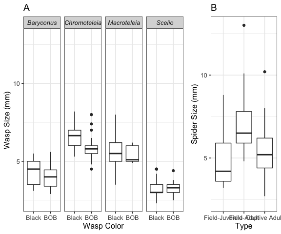
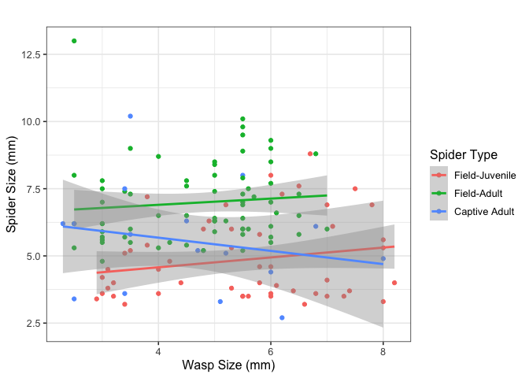
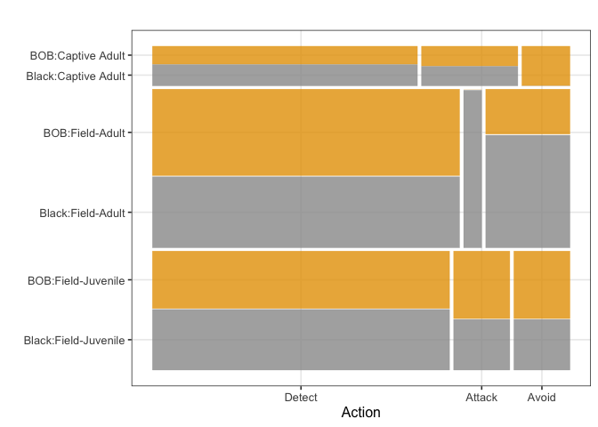
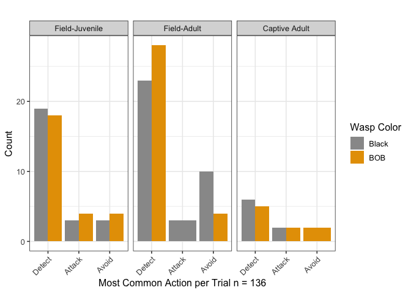
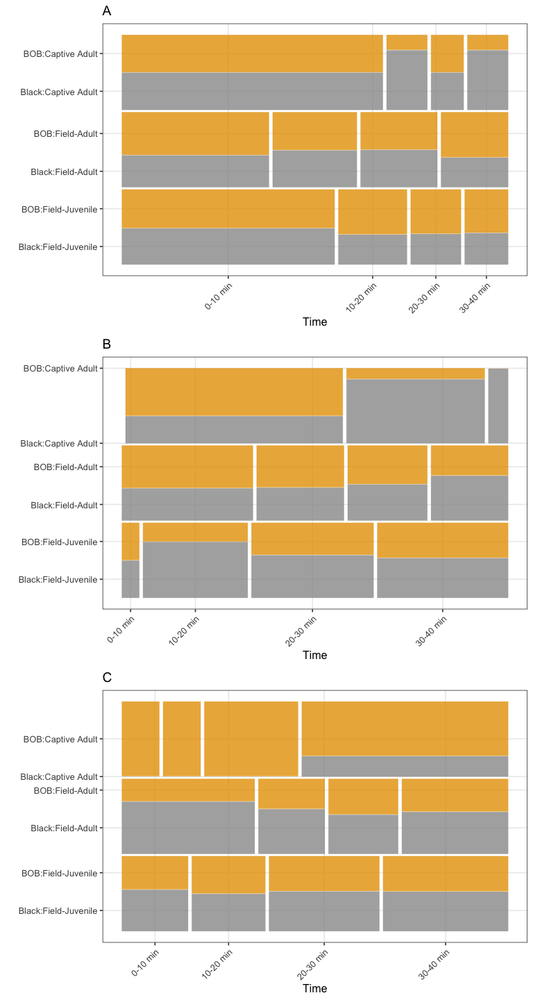

-   [Experiments of spiders with live
    prey](#experiments-of-spiders-with-live-prey)
    -   [Methods](#methods)
    -   [Results](#results)
        -   [Association between sizes (not included in the
            paper):](#association-between-sizes-not-included-in-the-paper)
        -   [Multinomial Model](#multinomial-model)
        -   [Timelines (original version)](#timelines-original-version)
        -   [Timelines (bar plots option)](#timelines-bar-plots-option)
        -   [Re-coding of BOB for Table
            1](#re-coding-of-bob-for-table-1)
-   [Experiment of spiders with false prey in automated
    cage](#experiment-of-spiders-with-false-prey-in-automated-cage)
    -   [Methods](#methods-1)
    -   [Results](#results-1)
-   [Colophon](#colophon)

Experiments of spiders with live prey
=====================================

Methods
-------

A total of 136 trials with three groups of spiders (68 field-juveniles,
51 field-adults and 17 captive-adults) and live prey were carried out
during which the following data were recorded: spider type (juvenile,
adult, reared), wasp color (BOB or black), spider behavior (behavioral
scale explained before), time when the spider reacted (0-5, 5-10, 10-20,
20-30, 30-40 minutes), the distance between the spider and the prey
during each behavior, presence/absence of a silk dragline, and wasp and
spider body length. For each of the 136 trials consisting of a wasp with
a spider, the size of each was measured (S3 Fig.). Although there is
size variation within each group, predator (spiders) and prey (wasps)
fall within the same general range, with field-captured adult spiders
being the largest.

A multinomial logistic regression \[26\] was fitted to a simplified
response: the most common activity for each spider was classified as
“detect”, “attack” or “avoid”, in order to correct for zero or near zero
counts in each response category. The full model includes the following
covariates: wasp color, spider type, wasp size, spider size, wasp genus
and presence/absence of silk dragline. This model was compared with
simplified versions, with the result being that the model with wasp
color and spider type was the model with the best fit, according to the
AIC statistic. Additionally, frequency of actions for each group of
spiders were calculated according to 10 minute slots, in order to define
a clear timeline of spider behavior in the controlled experiments.

A separate experiment with lures in the automated cage included 30
trials, during which the following variables were recorded:
presence/absence of silk dragline, spider size, background experimental
arena color (black or white) and color of false prey (BOB vs black) that
first attracted the spider. The response variable in this case was
constructed by registering whether L. jemineus responded in the same way
to black and BOB lures coded as 1, and whether L. jemineus responded in
a different way to black and BOB lures coded as 2. Contingency tables
were calculated, along with a Chi Square independence test for the
response versus each of the variables: presence/absence of silk
dragline, background color and prey color that first attracted the
spider.

Results
-------

For each of the 136 trials consisting of a wasp with a spider, the size
of each was measured (Fig. 3 A, B). Although there is size variation
within each group, predator (spiders) and prey (wasps) fall within the
same general range, with field-captured adult spiders being the largest.

``` r
source(file="read_data.R")
```

    ## New names:
    ## * `` -> ...1
    ## * `` -> ...2
    ## * `Prey alert and swivel` -> `Prey alert and swivel...3`
    ## * `stalked and contact` -> `stalked and contact...4`
    ## * `detected and retrive` -> `detected and retrive...6`
    ## * ...

``` r
resumen <- datos %>% group_by(ID) %>%
  summarise(type=(unique(type)),
            typegr=(unique(typegr)),
            w_color=(unique(w_color)),
            w_size=(unique(w_size)),
            s_type=(unique(s_type)),
            s_size=(unique(s_size)), 
            drag=(unique(drag))) %>% 
  arrange(type, w_color, s_type)
```

    ## `summarise()` ungrouping output (override with `.groups` argument)

``` r
ftable(table(resumen$w_color,resumen$type))
```

    ##        Baryconus Chromoteleia Macroteleia Scelio
    ##                                                 
    ## Black          5           18          21     25
    ## BOB           15           37           5     10

``` r
ftable(table(resumen$w_color,resumen$typegr))
```

    ##        Baryconus Chrom. & Scelio Macroteleia
    ##                                             
    ## Black          5              43          21
    ## BOB           15              47           5

``` r
ftable(table(resumen$w_color,resumen$s_type))
```

    ##        Captivity Adult Field Adult Field Juvenile
    ##                                                  
    ## Black                8          36             25
    ## BOB                  9          32             26

``` r
bp1 <- ggplot(resumen, aes(x=w_color, y=w_size)) + 
  geom_boxplot()+ facet_wrap(~type, ncol=4)+theme(legend.position = "none")+ 
  # dejar la misma escala de spider size
  theme(strip.text = element_text(face = "italic"))+
  labs(title="A",x="Wasp Color", y = "Wasp Size (mm)") +
  ylim(c(min(resumen$w_size),max(resumen$s_size))) 

bp2 <- ggplot(resumen, aes(x=s_type, y=s_size)) + 
  geom_boxplot()+labs(title="B",x="Type", y = "Spider Size (mm)") +
  ylim(c(min(resumen$w_size),max(resumen$s_size))) 

grid.arrange(bp1, bp2, nrow = 1, widths=2:1)
```



### Association between sizes (not included in the paper):

``` r
bp <- ggplot(resumen, aes(x=w_size, y=s_size, color=s_type)) + geom_point()+ geom_smooth(method='lm', aes(color=s_type))+labs(color = "Spider Type")+
  labs(title="",x="Wasp Size (mm)", y = "Spider Size (mm)")
bp
```

    ## `geom_smooth()` using formula 'y ~ x'



``` r
summary(lm(s_size~w_size*s_type, data=resumen))
```

    ## 
    ## Call:
    ## lm(formula = s_size ~ w_size * s_type, data = resumen)
    ## 
    ## Residuals:
    ##     Min      1Q  Median      3Q     Max 
    ## -2.6473 -1.1202 -0.3064  0.8690  6.2731 
    ## 
    ## Coefficients:
    ##                             Estimate Std. Error t value Pr(>|t|)    
    ## (Intercept)                   6.6621     1.1524   5.781 5.22e-08 ***
    ## w_size                       -0.2459     0.2379  -1.033   0.3033    
    ## s_typeField Adult            -0.2248     1.3636  -0.165   0.8693    
    ## s_typeField Juvenile         -2.8205     1.3901  -2.029   0.0445 *  
    ## w_size:s_typeField Adult      0.3617     0.2809   1.288   0.2002    
    ## w_size:s_typeField Juvenile   0.4295     0.2740   1.567   0.1194    
    ## ---
    ## Signif. codes:  0 '***' 0.001 '**' 0.01 '*' 0.05 '.' 0.1 ' ' 1
    ## 
    ## Residual standard error: 1.538 on 130 degrees of freedom
    ## Multiple R-squared:  0.3205, Adjusted R-squared:  0.2943 
    ## F-statistic: 12.26 on 5 and 130 DF,  p-value: 9.581e-10

``` r
## Wrangle data:
datos <- datos %>% 
  mutate(h_resp3=recode_factor(h_resp2,
                        "3.Crouch, jump and contact prey"="Attack",
                        "4.Pierce and ingestion"="Attack",
                        "1.Prey alert and swivel"="Detect",
                        "2.Follow or stalk"="Detect",
                        "5.Undetected or ignored"="Avoid",
                        "6.Detect visually and withdraw"="Avoid",
                        "7.None"="Avoid")) 
d2<-datos %>% group_by(ID) %>% count(h_resp3) %>% top_n(1) 
```

    ## Selecting by n

``` r
rep <- d2 %>% group_by(ID) %>% filter(n()>1) %>%
  summarize(h_resp3=unique(h_resp3)[1], n=n())
```

    ## `summarise()` ungrouping output (override with `.groups` argument)

``` r
datos2<-bind_rows(rep,d2[!d2$ID%in%rep$ID,]) %>% arrange(ID)
datos_model <- inner_join(datos2, resumen, by="ID")
with(datos_model, ftable(h_resp3,w_color, s_type)) 
```

    ##                 s_type Captivity Adult Field Adult Field Juvenile
    ## h_resp3 w_color                                                  
    ## Attack  Black                        2           3              3
    ##         BOB                          2           0              4
    ## Detect  Black                        6          23             19
    ##         BOB                          5          28             18
    ## Avoid   Black                        0          10              3
    ##         BOB                          2           4              4

``` r
with(datos_model, ftable(h_resp3,w_color, type)) 
```

    ##                 type Baryconus Chromoteleia Macroteleia Scelio
    ## h_resp3 w_color                                               
    ## Attack  Black                2            1           2      3
    ##         BOB                  5            0           0      1
    ## Detect  Black                3           13          15     17
    ##         BOB                  9           31           5      6
    ## Avoid   Black                0            4           4      5
    ##         BOB                  1            6           0      3

### Multinomial Model

The multinomial logistic regression was fitted to a simplified response,
where the most common activity for each spider was classified as
“detect”, “attack” or “avoid”. A summary of the data included in the
final model is presented in Figure 4. Note that in this figure the
number of spiders differs between groups, which is why the bar for
lab-reared (captivity) adults is thinner than the ones for field adults
and field juveniles. The full model includes the following covariates:
wasp color, spider type, wasp size, spider size, wasp genus and
presence/absence of silk dragline. This model was compared with
simplified versions, with the result being that the model with
presence/absence of silk dragline and spider type was the model with the
best fit (AIC = 212.09).

``` r
c(test00$AIC,test01$AIC,test02$AIC,
  test03$AIC,test04$AIC,test05$AIC)
```

    ## [1] 212.0992 213.3870 213.4670 246.6749 220.1595 212.2821

``` r
test <- test00
summary(test)
```

    ## Call:
    ## multinom(formula = h_resp3 ~ drag + s_type, data = datos_model)
    ## 
    ## Coefficients:
    ##        (Intercept)     drag s_typeField Adult s_typeField Juvenile
    ## Detect   -2.636693 1.824126          2.272735             1.044499
    ## Avoid    -3.612583 1.459788          2.637445             1.044348
    ## 
    ## Std. Errors:
    ##        (Intercept)      drag s_typeField Adult s_typeField Juvenile
    ## Detect    1.623456 0.7574136         0.8922031            0.7584938
    ## Avoid     2.044980 0.9262859         1.1240895            1.0509210
    ## 
    ## Residual Deviance: 196.0992 
    ## AIC: 212.0992

``` r
z <- summary(test)$coefficients/summary(test)$standard.errors
p <- (1 - pnorm(abs(z), 0, 1)) * 2
p
```

    ##        (Intercept)       drag s_typeField Adult s_typeField Juvenile
    ## Detect   0.1043495 0.01602432        0.01085508            0.1684905
    ## Avoid    0.0773017 0.11503547        0.01896110            0.3203470

``` r
exp(summary(test)$coefficients)
```

    ##        (Intercept)     drag s_typeField Adult s_typeField Juvenile
    ## Detect  0.07159762 6.197373          9.705915             2.841976
    ## Avoid   0.02698206 4.305046         13.977451             2.841544

According to the aforementioned model, being a field adult is a
significant factor for increasing the odds of detecting versus attacking
(pvalue = 0.0108), and for avoiding versus attacking (pvalue = 0.0189).
This shows that field adults are more likely to detect or avoid than to
attack, compared to adults reared in captivity which appear to prefer
attacking. Similarly, not using silk is associated with an increased
chance of detecting versus attacking (pvalue = 0.0160), which makes
sense since these spiders use silk only when attacking. Being a
field-caught juvenile versus an adult reared in captivity did not make a
difference in the most common spider actions. Other factors such as wasp
color, wasp size, spider size, and wasp genus did not make a
statistically significant difference when included in the full model. It
should however be noted that field-caught adults only attacked black
wasps, and adults reared in captivity avoided only BOB wasps.

``` r
datos_model <- datos_model %>%
  mutate(h_resp3=recode_factor(h_resp3, "Detect"="Detect",
                                "Attack"="Attack",
                                "Avoid"="Avoid"))
ggplot(data = datos_model) +
  geom_mosaic(aes(x = product(h_resp3, s_type), 
                  fill=w_color), 
              na.rm=TRUE, divider=mosaic("v")) +  
  theme(legend.position = "none") +
  scale_fill_manual(values=c("#999999", "#E69F00")) +labs(x = "Action", title='', y="")
```



### Timelines (original version)

``` r
options <- sort(unique(datos$h_resp3))
datos <- datos %>% mutate(time3= recode_factor(time2, 
          "0-5 min"   = "0-10 min",
          "5-10 min"  = "0-10 min",
          "10-20 min" = "10-20 min",
          "20-30 min" = "20-30 min",
          "30-40 min" = "30-40 min"))
dat<-datos[datos$h_resp3=="Detect",] %>%
  mutate(s_type=recode_factor(s_type,
                              "Wild Juvenile"="Field-Juvenile",
                              "Wild Adult"="Field-Adult",
                              "Adult Captivity"="Captivity-Adult")) 

ta1<- ggplot(data = dat) +
  geom_mosaic(data=dat,aes(x = product(w_color, time3), 
                           fill=w_color, 
                           conds=product(s_type)), 
              na.rm=TRUE, divider=mosaic("v")) + 
  scale_fill_manual(values=c("#999999", "#E69F00")) +
  labs(x = "Time", title='A', y="")+
  theme(legend.position = "none") +
  theme(axis.text.x = element_text(angle = 45, hjust = 1))

dat<-datos[datos$h_resp3=="Attack",] %>%
  mutate(s_type=recode_factor(s_type,
                              "Wild Juvenile"="Field-Juvenile",
                              "Wild Adult"="Field-Adult",
                              "Adult Captivity"="Captivity-Adult")) 

ta2<- ggplot(data = dat) +
  geom_mosaic(data=dat,aes(x = product(w_color, time3), 
                           fill=w_color, 
                           conds=product(s_type)), 
              na.rm=TRUE, divider=mosaic("v")) + 
  scale_fill_manual(values=c("#999999", "#E69F00")) +
  labs(x = "Time", title='B', y="")+
  theme(legend.position = "none") +
  theme(axis.text.x = element_text(angle = 45, hjust = 1))

dat<-datos[datos$h_resp3=="Avoid",] %>%
  mutate(s_type=recode_factor(s_type,
                              "Wild Juvenile"="Field-Juvenile",
                              "Wild Adult"="Field-Adult",
                              "Adult Captivity"="Captivity-Adult")) 

ta3<- ggplot(data = dat) +
  geom_mosaic(data=dat,aes(x = product(w_color, time3), 
                           fill=w_color, 
                           conds=product(s_type)), 
              na.rm=TRUE, divider=mosaic("v")) + 
  scale_fill_manual(values=c("#999999", "#E69F00")) +
  labs(x = "Time", title='C', y="")+
  theme(legend.position = "none") +
  theme(axis.text.x = element_text(angle = 45, hjust = 1))

grid.arrange(ta1, ta2, ta3, nrow = 3)
```



### Timelines (bar plots option)

``` r
options <- sort(unique(datos$h_resp3))
dat<-datos[datos$h_resp3=="Detect",] %>%
  mutate(s_type=recode_factor(s_type,
                              "Wild Juvenile"="Field-Juvenile",
                              "Wild Adult"="Field-Adult",
                              "Adult Captivity"="Captivity-Adult")) %>% 
  group_by(s_type, w_color, time3) %>% summarise(n=n())
```

    ## `summarise()` regrouping output by 's_type', 'w_color' (override with `.groups` argument)

``` r
t1<-   ggplot(data=dat, aes(x=time3, y=n, fill=w_color)) +
  geom_bar(stat="identity") + 
  facet_wrap(~s_type, ncol=5)+
  scale_fill_manual(name = "Wasp Color", values=c("#999999", "#E69F00")) +
  labs(x = "Time", title='A', y="")+
  #theme(legend.position = "none") +
  theme(axis.text.x = element_text(angle = 45, hjust = 1))

dat<-datos[datos$h_resp3=="Attack",] %>%
  mutate(s_type=recode_factor(s_type,
                              "Wild Juvenile"="Field-Juvenile",
                              "Wild Adult"="Field-Adult",
                              "Adult Captivity"="Captivity-Adult")) %>% 
  group_by(s_type, w_color, time3) %>% summarise(n=n())
```

    ## `summarise()` regrouping output by 's_type', 'w_color' (override with `.groups` argument)

``` r
t2<-  ggplot(data=dat, aes(x=time3, y=n, fill=w_color)) +
  geom_bar(stat="identity") + 
  facet_wrap(~s_type, ncol=5)+
  scale_fill_manual(name = "Wasp Color", values=c("#999999", "#E69F00")) +
  labs(x = "Time", title='B', y="")+
  #theme(legend.position = "none") +
  theme(axis.text.x = element_text(angle = 45, hjust = 1))
  
dat<-datos[datos$h_resp3=="Avoid",] %>%
  mutate(s_type=recode_factor(s_type,
                              "Wild Juvenile"="Field-Juvenile",
                              "Wild Adult"="Field-Adult",
                              "Adult Captivity"="Captivity-Adult")) %>% 
  group_by(s_type, w_color, time3) %>% summarise(n=n())
```

    ## `summarise()` regrouping output by 's_type', 'w_color' (override with `.groups` argument)

``` r
t3<-   ggplot(data=dat, aes(x=time3, y=n, fill=w_color)) +
  geom_bar(stat="identity") + 
  facet_wrap(~s_type, ncol=5)+
  scale_fill_manual(name = "Wasp Color",values=c("#999999", "#E69F00")) +
  labs(x = "Time", title='C', y="")+
 # theme(legend.position = "none") +
  theme(axis.text.x = element_text(angle = 45, hjust = 1))
  
grid.arrange(t1, t2, t3, nrow = 3)
```



### Re-coding of BOB for Table 1

``` r
# Re-code BOB and Black:
datos_model$w_color2<-if_else(datos_model$w_color=="Black","Black", 
  if_else(datos_model$typegr =="Macroteleia"&datos_model$w_color=="BOB","BOB","PseudoBOB")) 

datos_model <- datos_model %>%
  mutate(w_color2=recode_factor(w_color2, "Black"="Black",
                                "PseudoBOB"="PseudoBOB",
                                "BOB"="BOB"))

with(datos_model, ftable(type,w_color2,h_resp3))
```

    ##                        h_resp3 Detect Attack Avoid
    ## type         w_color2                             
    ## Baryconus    Black                  3      2     0
    ##              PseudoBOB              9      5     1
    ##              BOB                    0      0     0
    ## Chromoteleia Black                 13      1     4
    ##              PseudoBOB             31      0     6
    ##              BOB                    0      0     0
    ## Macroteleia  Black                 15      2     4
    ##              PseudoBOB              0      0     0
    ##              BOB                    5      0     0
    ## Scelio       Black                 17      3     5
    ##              PseudoBOB              6      1     3
    ##              BOB                    0      0     0

``` r
ftable(table(datos_model$w_color2,datos_model$h_resp3))
```

    ##            Detect Attack Avoid
    ##                               
    ## Black          48      8    13
    ## PseudoBOB      46      6    10
    ## BOB             5      0     0

``` r
ftable(table(datos_model$h_resp3, 
             datos_model$s_type, 
             datos_model$w_color))
```

    ##                         Black BOB
    ##                                  
    ## Detect Captivity Adult      6   5
    ##        Field Adult         23  28
    ##        Field Juvenile      19  18
    ## Attack Captivity Adult      2   2
    ##        Field Adult          3   0
    ##        Field Juvenile       3   4
    ## Avoid  Captivity Adult      0   2
    ##        Field Adult         10   4
    ##        Field Juvenile       3   4

``` r
datos_model <- datos_model %>%
  mutate(h_resp3=recode_factor(h_resp3, "Detect"="Detect",
                                "Attack"="Attack",
                                "Avoid"="Avoid"))
```

Experiment of spiders with false prey in automated cage
=======================================================

Methods
-------

The experiment with false prey (lures) in the automated cage included 30
trials, during which the following variables were recorded:
presence/absence of silk dragline, spider size, background experimental
arena color (black or white) and color of false prey (BOB vs black) that
first attracted the spider.

The response variable in this case was constructed following the
algorithm:

1.  L. jemineus responded similarly to black and BOB lures = 1
2.  L. jemineus responded differently to black and BOB lures = 2

Contingency tables were calculated, along with a Chi Square independence
test for the response versus each of the variables: presence/absence of
silk dragline, background color and prey color that first attracted the
spider.

Results
-------

Table 1 presents the results from the experiment with false prey. Each
contingency table was tested for independence, and the results were that
there is no evidence of dependence in any of the cases. In other words,
spider behaviors are not associated with background color, the color of
lure that was detected first, the use or non-use of silk, or predator
size.

``` r
library(DescTools)

names(datos_cont)
```

    ## [1] "n_exp"  "backgr" "resp"   "s_size" "silk"   "first"

``` r
tab1<-table(datos_cont$resp,
            datos_cont$backgr)
GTest(tab1)
```

    ## 
    ##  Log likelihood ratio (G-test) test of independence without correction
    ## 
    ## data:  tab1
    ## G = 2.0879, X-squared df = 1, p-value = 0.1485

``` r
prop.table(tab1)
```

    ##                    
    ##                         Black     White
    ##   Different actions 0.2000000 0.1000000
    ##   Same actions      0.2666667 0.4333333

``` r
tab2<-table(datos_cont$resp,
            datos_cont$first)
GTest(tab2)
```

    ## 
    ##  Log likelihood ratio (G-test) test of independence without correction
    ## 
    ## data:  tab2
    ## G = 0.06728, X-squared df = 1, p-value = 0.7953

``` r
prop.table(tab2)
```

    ##                    
    ##                     Black BOB
    ##   Different actions   0.2 0.1
    ##   Same actions        0.5 0.2

``` r
tab3<-table(datos_cont$resp,
            datos_cont$silk)
GTest(tab3)
```

    ## 
    ##  Log likelihood ratio (G-test) test of independence without correction
    ## 
    ## data:  tab3
    ## G = 0.0089311, X-squared df = 1, p-value = 0.9247

``` r
prop.table(tab3)
```

    ##                    
    ##                        No silk       Silk
    ##   Different actions 0.23333333 0.06666667
    ##   Same actions      0.53333333 0.16666667

Statistical analysis was performed using the computing environment R (R
Core Team, 2019). Data formatting and figures were prepared using the
Tidyverse packages (Wickham, 2017). Multinomial logistic regression was
done using the nnet package (Venables et al, 2002).

Colophon
========

This report was generated on 2020-09-19 14:58:11 using the following
computational environment and dependencies:

``` r
# which R packages and versions?
if ("devtools" %in% installed.packages()) devtools::session_info()
```

    ## ─ Session info ───────────────────────────────────────────────────────────────
    ##  setting  value                       
    ##  version  R version 4.0.2 (2020-06-22)
    ##  os       macOS Catalina 10.15.6      
    ##  system   x86_64, darwin17.0          
    ##  ui       X11                         
    ##  language (EN)                        
    ##  collate  en_US.UTF-8                 
    ##  ctype    en_US.UTF-8                 
    ##  tz       America/Costa_Rica          
    ##  date     2020-09-19                  
    ## 
    ## ─ Packages ───────────────────────────────────────────────────────────────────
    ##  package      * version  date       lib source        
    ##  assertthat     0.2.1    2019-03-21 [1] CRAN (R 4.0.2)
    ##  backports      1.1.10   2020-09-15 [1] CRAN (R 4.0.2)
    ##  blob           1.2.1    2020-01-20 [1] CRAN (R 4.0.2)
    ##  boot           1.3-25   2020-04-26 [1] CRAN (R 4.0.2)
    ##  broom          0.7.0    2020-07-09 [1] CRAN (R 4.0.2)
    ##  callr          3.4.4    2020-09-07 [1] CRAN (R 4.0.2)
    ##  cellranger     1.1.0    2016-07-27 [1] CRAN (R 4.0.2)
    ##  class          7.3-17   2020-04-26 [1] CRAN (R 4.0.2)
    ##  cli            2.0.2    2020-02-28 [1] CRAN (R 4.0.2)
    ##  colorspace     1.4-1    2019-03-18 [1] CRAN (R 4.0.2)
    ##  crayon         1.3.4    2017-09-16 [1] CRAN (R 4.0.2)
    ##  data.table     1.13.0   2020-07-24 [1] CRAN (R 4.0.2)
    ##  DBI            1.1.0    2019-12-15 [1] CRAN (R 4.0.2)
    ##  dbplyr         1.4.4    2020-05-27 [1] CRAN (R 4.0.2)
    ##  desc           1.2.0    2018-05-01 [1] CRAN (R 4.0.2)
    ##  DescTools    * 0.99.38  2020-09-07 [1] CRAN (R 4.0.2)
    ##  devtools       2.3.2    2020-09-18 [1] CRAN (R 4.0.2)
    ##  digest         0.6.25   2020-02-23 [1] CRAN (R 4.0.2)
    ##  dplyr        * 1.0.2    2020-08-18 [1] CRAN (R 4.0.2)
    ##  e1071          1.7-3    2019-11-26 [1] CRAN (R 4.0.2)
    ##  ellipsis       0.3.1    2020-05-15 [1] CRAN (R 4.0.2)
    ##  evaluate       0.14     2019-05-28 [1] CRAN (R 4.0.1)
    ##  Exact          2.0      2019-10-14 [1] CRAN (R 4.0.2)
    ##  expm           0.999-5  2020-07-20 [1] CRAN (R 4.0.2)
    ##  extrafont    * 0.17     2014-12-08 [1] CRAN (R 4.0.2)
    ##  extrafontdb    1.0      2012-06-11 [1] CRAN (R 4.0.2)
    ##  fansi          0.4.1    2020-01-08 [1] CRAN (R 4.0.2)
    ##  farver         2.0.3    2020-01-16 [1] CRAN (R 4.0.2)
    ##  forcats      * 0.5.0    2020-03-01 [1] CRAN (R 4.0.2)
    ##  foreign      * 0.8-80   2020-05-24 [1] CRAN (R 4.0.2)
    ##  fs             1.5.0    2020-07-31 [1] CRAN (R 4.0.2)
    ##  generics       0.0.2    2018-11-29 [1] CRAN (R 4.0.2)
    ##  ggmosaic     * 0.2.0    2018-09-12 [1] CRAN (R 4.0.2)
    ##  ggplot2      * 3.3.2    2020-06-19 [1] CRAN (R 4.0.2)
    ##  gld            2.6.2    2020-01-08 [1] CRAN (R 4.0.2)
    ##  glue           1.4.2    2020-08-27 [1] CRAN (R 4.0.2)
    ##  gridExtra    * 2.3      2017-09-09 [1] CRAN (R 4.0.2)
    ##  gtable         0.3.0    2019-03-25 [1] CRAN (R 4.0.2)
    ##  haven          2.3.1    2020-06-01 [1] CRAN (R 4.0.2)
    ##  hms            0.5.3    2020-01-08 [1] CRAN (R 4.0.2)
    ##  htmltools      0.5.0    2020-06-16 [1] CRAN (R 4.0.2)
    ##  htmlwidgets    1.5.1    2019-10-08 [1] CRAN (R 4.0.2)
    ##  httr           1.4.2    2020-07-20 [1] CRAN (R 4.0.2)
    ##  jsonlite       1.7.1    2020-09-07 [1] CRAN (R 4.0.2)
    ##  knitr          1.29     2020-06-23 [1] CRAN (R 4.0.2)
    ##  labeling       0.3      2014-08-23 [1] CRAN (R 4.0.2)
    ##  lattice        0.20-41  2020-04-02 [1] CRAN (R 4.0.2)
    ##  lazyeval       0.2.2    2019-03-15 [1] CRAN (R 4.0.2)
    ##  lifecycle      0.2.0    2020-03-06 [1] CRAN (R 4.0.2)
    ##  lmom           2.8      2019-03-12 [1] CRAN (R 4.0.2)
    ##  lubridate      1.7.9    2020-06-08 [1] CRAN (R 4.0.2)
    ##  magrittr       1.5      2014-11-22 [1] CRAN (R 4.0.2)
    ##  MASS           7.3-51.6 2020-04-26 [1] CRAN (R 4.0.2)
    ##  Matrix         1.2-18   2019-11-27 [1] CRAN (R 4.0.2)
    ##  memoise        1.1.0    2017-04-21 [1] CRAN (R 4.0.2)
    ##  mgcv           1.8-31   2019-11-09 [1] CRAN (R 4.0.2)
    ##  modelr         0.1.8    2020-05-19 [1] CRAN (R 4.0.2)
    ##  munsell        0.5.0    2018-06-12 [1] CRAN (R 4.0.2)
    ##  mvtnorm        1.1-1    2020-06-09 [1] CRAN (R 4.0.2)
    ##  nlme           3.1-148  2020-05-24 [1] CRAN (R 4.0.2)
    ##  nnet         * 7.3-14   2020-04-26 [1] CRAN (R 4.0.2)
    ##  pillar         1.4.6    2020-07-10 [1] CRAN (R 4.0.2)
    ##  pkgbuild       1.1.0    2020-07-13 [1] CRAN (R 4.0.2)
    ##  pkgconfig      2.0.3    2019-09-22 [1] CRAN (R 4.0.2)
    ##  pkgload        1.1.0    2020-05-29 [1] CRAN (R 4.0.2)
    ##  plotly         4.9.2.1  2020-04-04 [1] CRAN (R 4.0.2)
    ##  plyr           1.8.6    2020-03-03 [1] CRAN (R 4.0.2)
    ##  prettyunits    1.1.1    2020-01-24 [1] CRAN (R 4.0.2)
    ##  processx       3.4.4    2020-09-03 [1] CRAN (R 4.0.2)
    ##  productplots   0.1.1    2016-07-02 [1] CRAN (R 4.0.2)
    ##  ps             1.3.4    2020-08-11 [1] CRAN (R 4.0.2)
    ##  purrr        * 0.3.4    2020-04-17 [1] CRAN (R 4.0.2)
    ##  R6             2.4.1    2019-11-12 [1] CRAN (R 4.0.2)
    ##  Rcpp           1.0.5    2020-07-06 [1] CRAN (R 4.0.2)
    ##  readr        * 1.3.1    2018-12-21 [1] CRAN (R 4.0.2)
    ##  readxl       * 1.3.1    2019-03-13 [1] CRAN (R 4.0.2)
    ##  remotes        2.2.0    2020-07-21 [1] CRAN (R 4.0.2)
    ##  reprex         0.3.0    2019-05-16 [1] CRAN (R 4.0.2)
    ##  reshape2     * 1.4.4    2020-04-09 [1] CRAN (R 4.0.2)
    ##  rlang          0.4.7    2020-07-09 [1] CRAN (R 4.0.2)
    ##  rmarkdown      2.3      2020-06-18 [1] CRAN (R 4.0.2)
    ##  rprojroot      1.3-2    2018-01-03 [1] CRAN (R 4.0.2)
    ##  rstudioapi     0.11     2020-02-07 [1] CRAN (R 4.0.2)
    ##  Rttf2pt1       1.3.8    2020-01-10 [1] CRAN (R 4.0.2)
    ##  rvest          0.3.6    2020-07-25 [1] CRAN (R 4.0.2)
    ##  scales         1.1.1    2020-05-11 [1] CRAN (R 4.0.2)
    ##  sessioninfo    1.1.1    2018-11-05 [1] CRAN (R 4.0.2)
    ##  stringi        1.5.3    2020-09-09 [1] CRAN (R 4.0.2)
    ##  stringr      * 1.4.0    2019-02-10 [1] CRAN (R 4.0.2)
    ##  testthat       2.3.2    2020-03-02 [1] CRAN (R 4.0.2)
    ##  tibble       * 3.0.3    2020-07-10 [1] CRAN (R 4.0.2)
    ##  tidyr        * 1.1.2    2020-08-27 [1] CRAN (R 4.0.2)
    ##  tidyselect     1.1.0    2020-05-11 [1] CRAN (R 4.0.2)
    ##  tidyverse    * 1.3.0    2019-11-21 [1] CRAN (R 4.0.2)
    ##  usethis        1.6.3    2020-09-17 [1] CRAN (R 4.0.2)
    ##  vctrs          0.3.4    2020-08-29 [1] CRAN (R 4.0.2)
    ##  viridisLite    0.3.0    2018-02-01 [1] CRAN (R 4.0.1)
    ##  withr          2.2.0    2020-04-20 [1] CRAN (R 4.0.2)
    ##  xfun           0.17     2020-09-09 [1] CRAN (R 4.0.2)
    ##  xml2           1.3.2    2020-04-23 [1] CRAN (R 4.0.2)
    ##  yaml           2.2.1    2020-02-01 [1] CRAN (R 4.0.2)
    ## 
    ## [1] /Library/Frameworks/R.framework/Versions/4.0/Resources/library

The current Git commit details are:

``` r
# what commit is this file at? 
if ("git2r" %in% installed.packages() & git2r::in_repository(path = ".")) git2r::repository(here::here())  
```

    ## Local:    master /Users/marce/Dropbox/Mora_CICIMA2
    ## Remote:   master @ origin (git@github.com:malfaro2/Mora_et_al2.git)
    ## Head:     [bac9b2c] 2020-09-15: Update README.md
